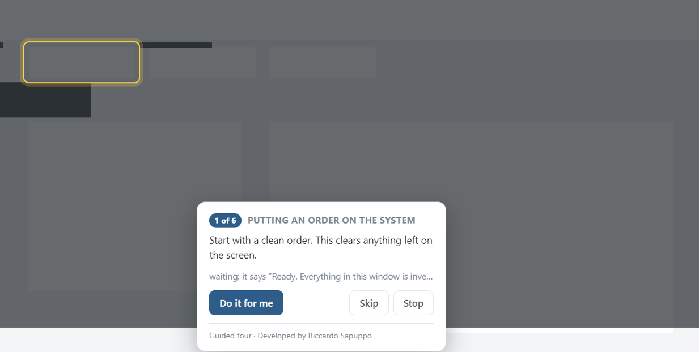
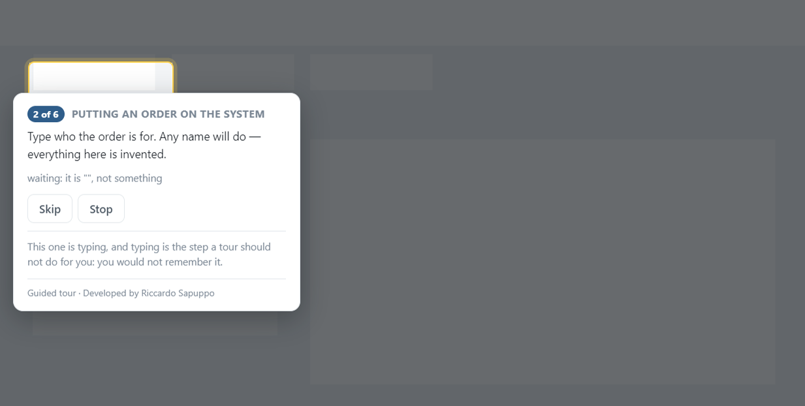
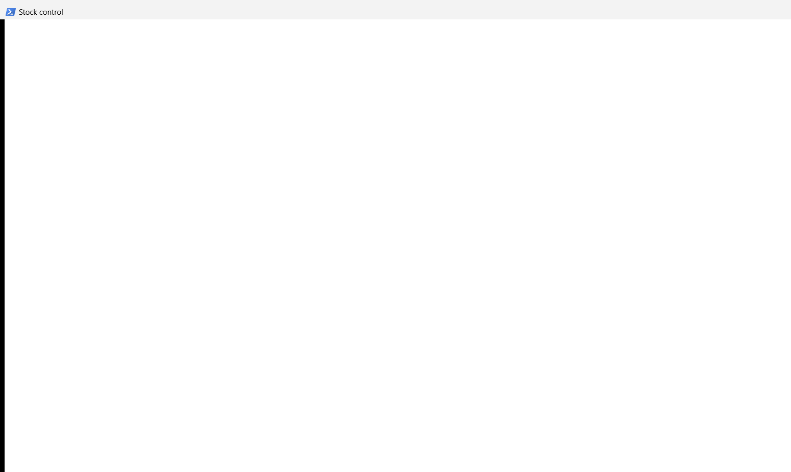

# Windows app guided tour

An overlay that teaches somebody a desktop application. It dims the screen
except the control being explained, waits until that step has actually been
done, and — where it makes sense — does the step for them.



## The hard part is not drawing the box

It is knowing when to move on.

The easy answer — *we sent a click, so it happened* — is what makes most overlay
tutorials infuriating. The click landed on a button that was greyed out. The
window had not finished drawing. The person had already done the step and is
being asked to do it again.

So nothing here is finished because the tour did something. **A step is finished
when the application says so**, read back out of the accessibility tree:

| | the step ends when |
|---|---|
| `value` | the text in a control is what it should be |
| `enabled` | a control that was greyed out is not any more |
| `says` | a status line contains a phrase |
| `gone` | a control is no longer there — dialogs |

There is deliberately **no** "the tour clicked it" condition. A step that cannot
be observed is worth knowing about while the tour is being written, not in front
of somebody being taught.

```json
{
  "id": "notice-save-is-live",
  "say": "Look at Save the order. It was greyed out a moment ago; now there is a line, it is not.",
  "point": { "id": "saveOrder" },
  "done": { "when": "enabled", "of": { "id": "saveOrder" } },
  "canDo": false,
  "whyNot": "There is nothing to do here. The step is finished the moment the application allows it, which is the point being made."
}
```

## And it says when it will not do a step for you

A tour that types your customer's name for you has taught you nothing. So a step
can decline, and when it does it says why rather than showing a button that does
not work.



## UI Automation, not coordinates and not pixels

Everything this knows about another application comes through **UI Automation**,
Windows' own accessibility interface, in one PowerShell helper. That is the
difference between this and most overlay tutorials:

- A control is found by its **automation id**, which does not move when the
  window is resized, does not change with the theme, and is not translated. An
  overlay driven by coordinates is an overlay that is wrong on the second
  machine it runs on.
- A button is pressed with **InvokePattern**, the way a screen reader presses it
  — not by moving the mouse there and clicking, which presses whatever is under
  that point at that instant. People move the mouse.
- What a step is waiting for is **read** from the control.

The one thing an application has to do to be teachable this way is give its
controls automation ids. That is the whole contract, and it is the same contract
that makes an application usable with a screen reader.

## Before you start

- **Windows.** UI Automation is a Windows interface; there is no cross-platform
  version of this and pretending otherwise would waste somebody's afternoon. The
  parts that are not Windows — the tour format, the conditions — are tested
  anywhere.
- **Node 20.11 or newer**, and **PowerShell 5.1**, which is on every Windows
  machine. Nothing to install for either.
- **Electron**, which is the only dependency and about 270 MB. It arrives with
  `npm install`.
- **Nothing else.** No compiler, no project file, no second machine, no licence.
  The application being taught is in this repository and is written in XAML
  inside a PowerShell script.
- **To undo it:** delete the folder.

## Running it

Two terminals.

```
npm install

npm run demo     # the invented application to be taught
npm start        # the tour over it
```

The overlay covers the screen — that is what it is for — and closes on **Stop**.

Point it at a different tour:

```
npm start -- --tour tours/stock-control.json --poll-ms 600
```

## The invented application

Everything in it is made up: the company, the parts, the customers, the numbers.



It is **WPF** rather than WinForms, and that is not a matter of taste. WPF is a
native UI Automation provider: every control comes out of the tree with its real
type, its automation id, its screen rectangle and the patterns it supports —
Invoke on a button, Value on a text box. The same controls in WinForms arrive
through the older bridge as untyped panes with no patterns at all, which is
enough to draw a box around and not enough to press or to read.

It is written in XAML inside PowerShell so it needs no compiler and no build
step. `Add-Type -AssemblyName PresentationFramework` is on every Windows
machine.

## Writing a tour of your own

Point the helper at your application and see what there is to point at:

```
powershell -File scripts/uia.ps1 -Command describe -Window "Your application"
```

Every control it can see comes back with its id, its type, its rectangle and its
patterns. A control with no automation id is one a tour cannot be written
against — and that is worth knowing about the application, rather than papering
over with a coordinate.

Then write the steps, and check them before anybody sees them:

```
npm run walkthrough
```

It starts the invented application itself if it is not already up, so it runs
from nothing.

## Checking it

```
npm run build       # starts the overlay for real and reads back what it did
npm test            # 30 assertions over the tour format
npm run walkthrough # 34 against the application, on Windows
```

**`npm run build`** is what a build means for a project with nothing to
compile: it starts the overlay, feeds it the messages the main process sends,
and reads back what the page did with them. It catches what a syntax check
cannot — a preload that exposes nothing, a page that throws on its first
message — every one of which leaves an overlay that opens and does nothing,
which is the worst way for this to fail because it looks like it is working.

It is also how the page came to have a Content-Security-Policy: starting it for
real is what said there was not one.

**`npm test`** checks the format with invented readings. It is good at saying
the rules still hold and completely blind to the failure this project actually
has: a tour that points at a control which is not there. A mistyped automation
id passes every unit test ever written and fails at step four, in front of the
person the tour was written for.

**`npm run walkthrough`** is the check not written behind the same door as the
code. It opens the real application and, for every step of every tour, finds
what the step points at, finds what it waits on, confirms a step offering to do
itself is on something that can actually be invoked — and then **does the whole
tour**, playing the part of the person, confirming every condition becomes true
in turn. A tour whose steps all point at real controls can still be one that
cannot be finished.

It caught a good one. The status line had an `AutomationProperties.Name`, and a
`TextBlock` exposes its **text** as its name — so the name replaced it, the line
reported its label for ever whatever it said, and three steps waited on a phrase
that could never arrive. Setting an accessible name on a text element hides the
text from everything that reads it, screen readers included.

## The pictures in this README

Taken by `npm run screenshots`, and **nothing in it photographs the screen**.

The obvious way to picture an overlay is to grab the desktop while it is up. It
works, and every frame is also a photograph of whatever else was open. Cropping
to the application does not help: the card deliberately sits outside the control
it describes, so any margin wide enough to include it is wide enough to include
the desktop behind.

So each thing is captured from itself — the application with `PrintWindow`,
which asks a window to draw into a bitmap and ignores whatever is on top of it;
the overlay with Electron's own `capturePage`, which renders the page and knows
nothing about a desktop. Neither can capture something that was not asked for.

## Where things are

```
scripts/uia.ps1      the one place this touches Windows. One command per run
src/
  locate/uia.js      the Node side: spawn, read a line of JSON
  tour/steps.js      what a step is, and how one is known to be finished
tour/                the overlay: main process, preload, and the page
demo/stock.ps1       an invented WPF application to be taught
tours/               the tours, as JSON
tools/               the checks not written behind the same door
```

## What this is not

- **It cannot teach an application that has no automation ids.** Nor should it
  pretend to: matching on a coordinate produces a tour that is confidently wrong
  on the next machine.
- **It does not record a tour by watching somebody.** That is a good idea and a
  different project; this one is written by hand, which is why the format is
  small enough to write by hand.
- **One display.** The overlay covers the primary one. Covering several means a
  window per display and a hole that can be on any of them.
- **It does not type for you**, by choice rather than by limitation — see the
  step that says so. The helper can, and only the check that plays the part of
  the person uses it.

## A note on what it can reach

The helper reads the accessibility tree of windows on the same desktop and, when
asked, invokes a control or sets a value in one. It writes no files, opens no
network connection, and takes no screenshots. That is the whole surface, it is
one file, and it is short enough to read.

## Licence

MIT. See [LICENSE](LICENSE).

Developed by Riccardo Sapuppo.
